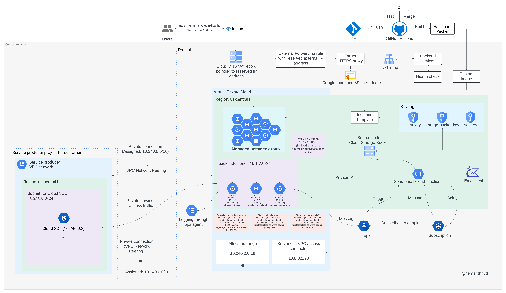
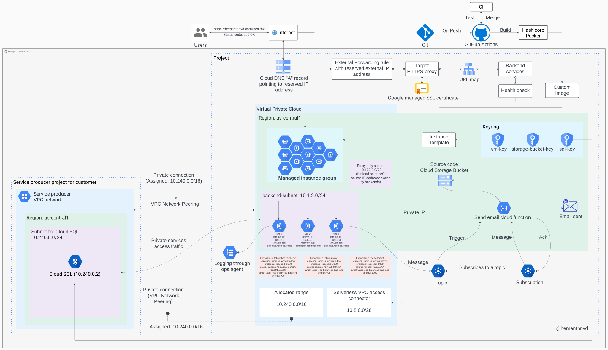

Terraform infra for CSYE 6225 GCP WEBAPP
## Terraform commands

  Initializes the working directory containing Terraform configuration files:

```console
$ terraform init
```

  Rewrite Terraform configuration files to a canonical format and style:

```console
$ terraform fmt .
```

  Validate the configuration files in a directory:

```console
$ terraform validate .
```

## Building the cloud infrastructure

  Create a terraform.tfvars file and include all the key value pairs as mentioned in variavles.tf
  Also include the gcp credential as mentioned below
  gcp_credentials = "C:/Users/user/Downloads/nameofgcpcredentialfile.json"

   Creates an execution plan, which lets you preview the changes that Terraform plans to make to your infrastructure:

```console
$ terraform plan
```

   Apply a configuration to build infra:

```console
$ terraform apply
```

## Destroying the cloud infrastructure

   Destroy infrastructure:

```console
$ terraform destroy
```

## Architecture Diagram

<!--  -->
